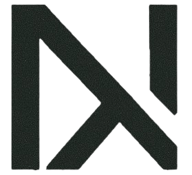
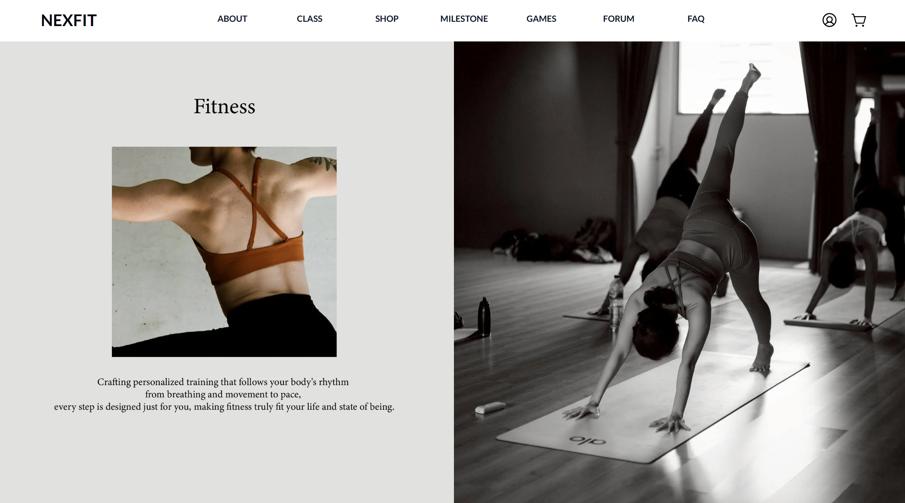
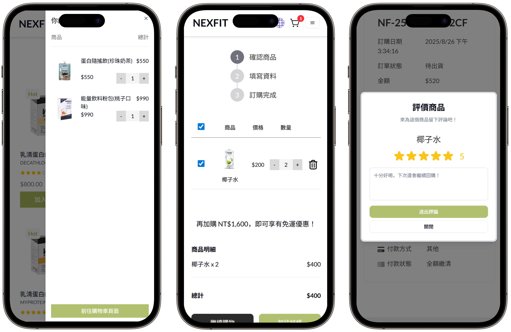
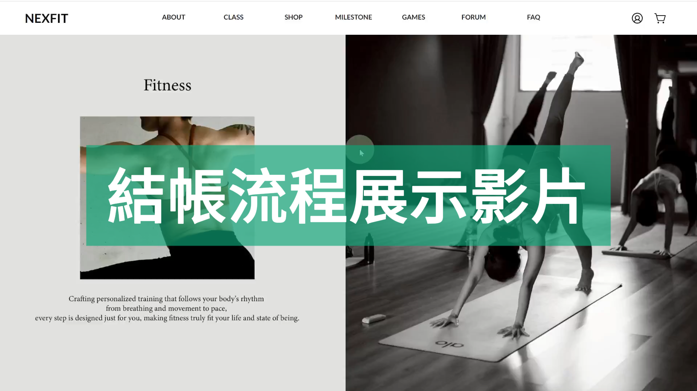
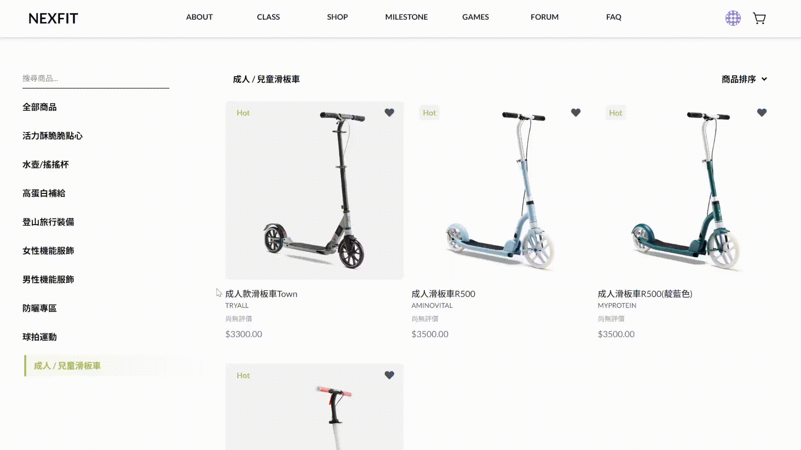
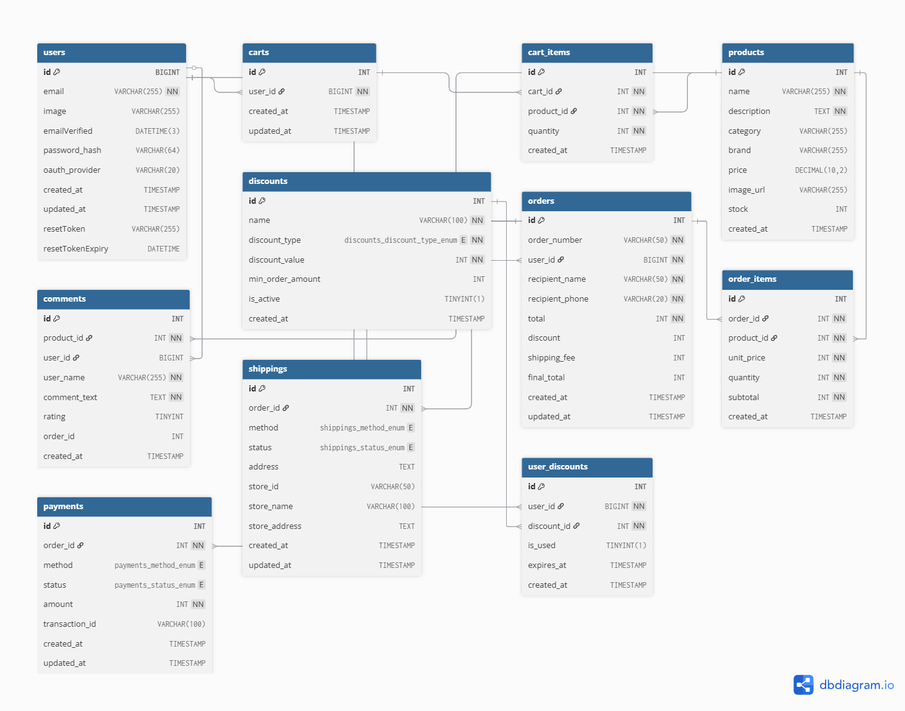

## 📖 專案簡介

Nexfit，一站式運動平台，提供課程預約與線上購物等功能。

此專案為團隊協作開發，我主要負責 **購物車與結帳流程設計**，以及 **商品評價與訂單管理功能開發**。

使用者登入後即可：

- 🛒 **購物車功能**：商品資料完整儲存在資料庫，跨裝置仍能保留購物紀錄
- 💳 **結帳流程**：確認訂單資訊與金額後送出
- ⭐ **商品評價**：使用者可針對已購買商品撰寫評論，並顯示於商品頁面
- 📦 **訂單管理**：會員可查看歷史訂單紀錄，包含狀態追蹤與明細

## 🔗 Demo 網站：https://nexfit-next.vercel.app/

部署：Vercel（前端+後端）、Railway（MySQL）

```bash
# 測試帳號
帳號：wang@test.com
密碼：Ss5566123
```





## ✨ 功能介紹

#### 結帳流程展示

[](https://youtu.be/k25QM0NxHpY)
[🔗 點擊前往觀看結帳流程](https://youtu.be/k25QM0NxHpY)

#### 加入購物車



#### 商品評價功能


## 🛠 技術棧

- **Next.js**：透過 Next.js API Routes 實作後端功能。
- **React**：前端 UI 框架，負責元件化開發
- **Tailwind CSS + shadcn/ui**：樣式與 UI 元件
- **MySQL**：資料儲存與管理
- **Vercel / Railway**：前後端與資料庫部署

## 🚀 快速開始

1. 取得專案

```bash
git clone https://github.com/eatbear25/Nexfit.git
```

2. .env.example，請複製為 .env 並填入實際值。
3. 安裝與啟動流程

```bash
npm install
npm run dev
```

4. 開啟網址：http://localhost:3000

## 資料表設計

此資料表設計支援購物車、訂單、優惠券與商品評論


